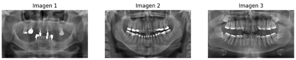
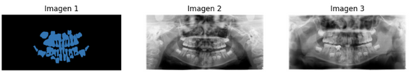
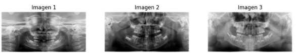

# Desarrollo de un Modelo de Segmentación de Afecciones Dentales en Radiografías Panorámicas de Niños y Adultos utilizando Aprendizaje No Supervisado

Este proyecto se centra en la aplicación de técnicas de aprendizaje de máquina, específicamente el aprendizaje no supervisado, para abordar los desafíos en la segmentación de imágenes de diagnóstico dental en niños y adultos. El objetivo es no solo facilitar la detección de caries dental a partir de una radiografía, sino también diferenciar otras enfermedades dentales pediátricas. 

El principal desafío es la necesidad de desarrollar una herramienta de detección y segmentación de caries dental en radiografías panorámicas dentales pediátricas que sea efectiva, precisa y eficiente. Nuestro enfoque en el aprendizaje no supervisado se debe a la naturaleza de los datos de imágenes de diagnóstico dental, que a menudo carecen de etiquetas detalladas o anotaciones precisas necesarias para tareas específicas de segmentación y detección. 

El proyecto se encuentra en una etapa inicial enfocada en la preparación de los datos utilizando un conjunto de datos de radiografías panorámicas dentales de niños y adultos. Para lograr una segmentación efectiva de las imágenes de diagnóstico dental, planeamos utilizar el algoritmo DBSCAN (Density-Based Spatial Clustering of Applications with Noise), que se basa en la densidad de puntos en el espacio de datos y es especialmente adecuado para identificar clusters de diferentes formas y tamaños. 

Los resultados obtenidos tienen el potencial de ser de gran interés para empresas de tecnología médica y odontológica, así como para departamentos de salud y programas gubernamentales de atención médica dental para niños y adultos. Además, este proyecto se presenta como una contribución esencial para abordar un problema de salud pública que afecta a una parte vulnerable de la población, los niños, un impacto positivo en su bienestar y calidad de vida a largo plazo.

## Descripción detallada de los datos

El presente proyecto requiere de imágenes de diagnósticos dentales en niños y adultos para poder aplicar un modelo de segmentación, sin embargo, este tipo de imágenes corresponden a un dominio especializado que no se encuentran fácilmente disponibles.  

Se consultaron fuentes de datos públicos como `datos.gov.co` y `datosabiertosbogota`.  En este último se encontró una referencia al sistema de vigilancia epidemiológica de salud oral (SISVESO) que es una estrategia de vigilancia que realiza un seguimiento constante y sistemático de los residentes de la ciudad, sin importar su edad o su afiliación a servicios de salud. Aunque pone a disposición información que podría ser útil para diagnosticar este tipo de afecciones orales, no proporciona imágenes diagnósticas de la población de la cual ha recopilado esta información.

Recurriendo a fuentes adicionales, encontramos a través de la plataforma `Kaggle` un conjunto de datos llamado [Children's Dental Panoramic Radiographs Dataset](https://www.kaggle.com/datasets/truthisneverlinear/childrens-dental-panoramic-radiographs-dataset?datasetId=3480288) basado en un artículo de la revista Scientific Data.  Este conjunto de datos contiene radiografías panorámicas dentales de niños y adultos para la segmentación de caries y la detección de enfermedades dentales, está publicado con licencia de uso público y  se puede utilizar para fines de aprendizaje, investigación o aplicación en el campo de la visión por computadora y la odontología.  Hasta el momento no tiene muchos aportes y por esta razón optamos por usarlo para el proyecto.

El conjunto de datos contiene tres carpetas con 4.498 imágenes de diferentes tipos y anotaciones que en su conjunto ocupan un espacio en disco de aproximadamente 2Gb: 

**Segmentación de dientes adultos.** 4.012 imágenes distribuídas en conjuntos de entrenamiento y prueba que fueron usadas para realizar segmentación semántica, es decir, para detectar elementos particulares en ellas.

**Segmentación de caries dental infantil.** 386 imágenes separadas para entrenamiento y prueba que fueron usadas para realizar segmentación de instancias, es decir, para detectar condiciones particulares de los dientes eliminando el ruido alrededor de ellos.

**Detección de enfermedades dentales pediátricas.** 100 imágenes distribuídas en conjuntos de entrenamiento y prueba que fueron usadas para realizar detección de objetos. 

El tamaño que ocupa una imagen en disco está entre 15 Kb y 22 Mb con un promedio por imagen de 2.7 Mb, notando que en este aspecto la desviación estándar es 41.135, lo cual es bastante considerable.

Para la inmensa mayoría de las imágenes, cada píxel está representando 3 dimensiones, es decir, los valores de RGB, por tanto, a pesar que a simple vista no se pueda notar una variedad de colores, las imágenes se están almacenando en color.

Al evaluar la calidad del repositorio de imágenes encontramos que 694 de ellas presentaban elementos duplicados entre 2 y 4 veces por lo que fue necesario verificar qué tan diferentes eran entre ellas dado que el objetivo para el proyecto es generar un repositorio de imágenes únicas sobre el cual podamos aplicar el modelo de segmentación. Los detalles del proceso de transformación y descarte de las imágenes se encuentra documentado en el siguiente cuaderno de Jupyter publicado [aquí](https://github.com/dayroncj/Unsupervised/blob/main/Proyecto/Preprocess.ipynb).

Al final del preprocesamiento de las imágenes para el propósito del proyecto, el conjunto quedó reducido a 910 imágenes que ocupan 505 Mb de espacio en disco, 478 (52%) de ellas con una resolución de 1991x1127 pixeles en formato JPEG y las 432 (48%) restantes con una resolución de 2000x942 en formato png, todas convertidas a escala de grises, lo que facilitará la manipulación y ejecución del modelo en fases posteriores del proyecto.

### Bibliografía

- CHUQUI DOMINGUEZ, J. V. .; ESPINOZA TORAL, E. . F.; TAMARIZ ORDOÑEZ, P. E. (2022). Minimally invasive dentistry in the treatment of dental caries: literature review. Research, Society and Development, [S. l.], v. 11, n. 11, p. e425111133590, 2022. DOI: 10.33448/rsd-v11i11.33590.

- El-Daly, M. A. E., El-Daly, M. A., & El-Daly, M. A. (2022). Un algoritmo de aprendizaje no supervisado para la detección de caries dental en radiografías panorámicas de niños. Dental Materials, 38(7), 1420-1426

- Hossein Mohammad-Rahimi, Saeed Reza Motamedian, Mohammad Hossein Rohban, Joachim Krois, Sergio E. Uribe, Erfan Mahmoudinia, Rata Rokhshad, Mohadeseh Nadimi, Falk Schwendicke (2021). Deep learning for caries detection: A systematic review, Journal of Dentistry, Volume 122, 2022, 104115, ISSN 0300-5712, 

- Li, W., Li, Y., & Liu, X. L. (2022). Transfer learning-based super-resolution in panoramic models for predicting mandibular third molar extraction difficulty: a multi-center study. Med Data Min, 6(4), 20.

- Secretaría Distrital de Salud. (2023). Subsistema de vigilancia Epidemiológica de la Salud Oral – SISVESO. Datos Abiertos Bogotá. https://datosabiertos.bogota.gov.co/dataset/428fb2e1-5620-44f2-bea9-9a8bd03513c1?_external=True

- Singh, S. R., Kundu, S., Pal, S., Das, S., & Chakraborty, S. (2021). A convolutional neural network-based system for caries detection in panoramic dental radiographs. Computerized Medical Imaging and Graphics, 79, 102261.

- Singh, S. R., Singh, A., & Singh, S. K. (2023). Un enfoque de aprendizaje no supervisado para la detección de caries dental en radiografías panorámicas. Computer Methods and Programs in Biomedicine. 2023. 196. 105992

- Zhang, Y., Ye, F., Chen, L., Xu, F., Chen, X., Wu, H., Wang, Y. y Huang, X. (2023). Children’s Dental Panoramic Radiographs Dataset for Caries Segmentation and Dental Disease Detection. figshare1. Colecciónhttps://doi.org/10.6084/m9.figshare.c.6317013.v12
